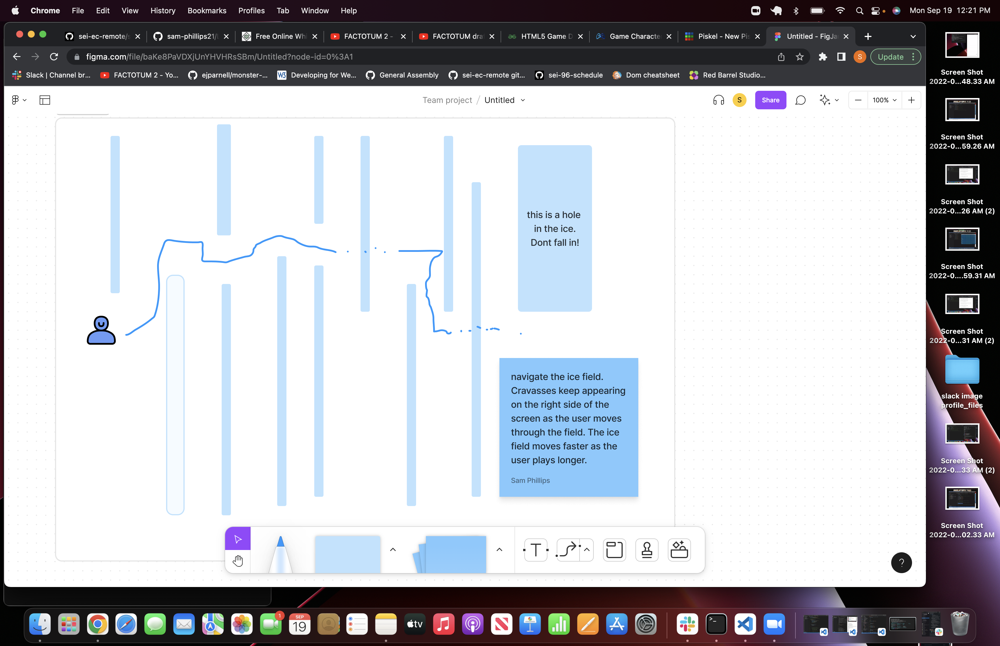

project one: Crevasse jumper.

background, set, setting: a mountaineer visits various mountains littered with crevasses. Stuck on a frigid glacier in the middle of nowhere, the mountaineer must navigate through the intense glacier. 

Elements: Either a scroling background that moves and the mountaineer is forced to navigate through the terrain. or a background that moves as the mountaineer moves through the complex terrain. 
    1. moving background
    2. moveable character (the mountaineer)
    3. left right forward movements.
 
    4. colision detection: coliding with the cravasse or jumping into it
    
        

User interface/ Functions:

1. A function to load the crevasse field/ generates playing field. some kind of crevasse generator/game loop
2. a function to move the character: movement handler. 
3. an in screen alert function to alert user of death or game over.

Wireframe:

Schedule

monday september 19th:

do basic html and rough css.
work on project... and sudo code. 
Get approved for project.
work with Ta's during office hours
Tuesday: begin writing functions to create functionality of the game.
work  with Ta's during office hours
wednesday: keep working on functions
work with Ta's during office hours

thurday: assess progress and areas in which need improvement
work with Ta's during office hours
friday: have all questions answered and have a functioning program

saturday/sunday: finish styling and debugging. Make sure game meets all requirements 

sunday pm: submit project